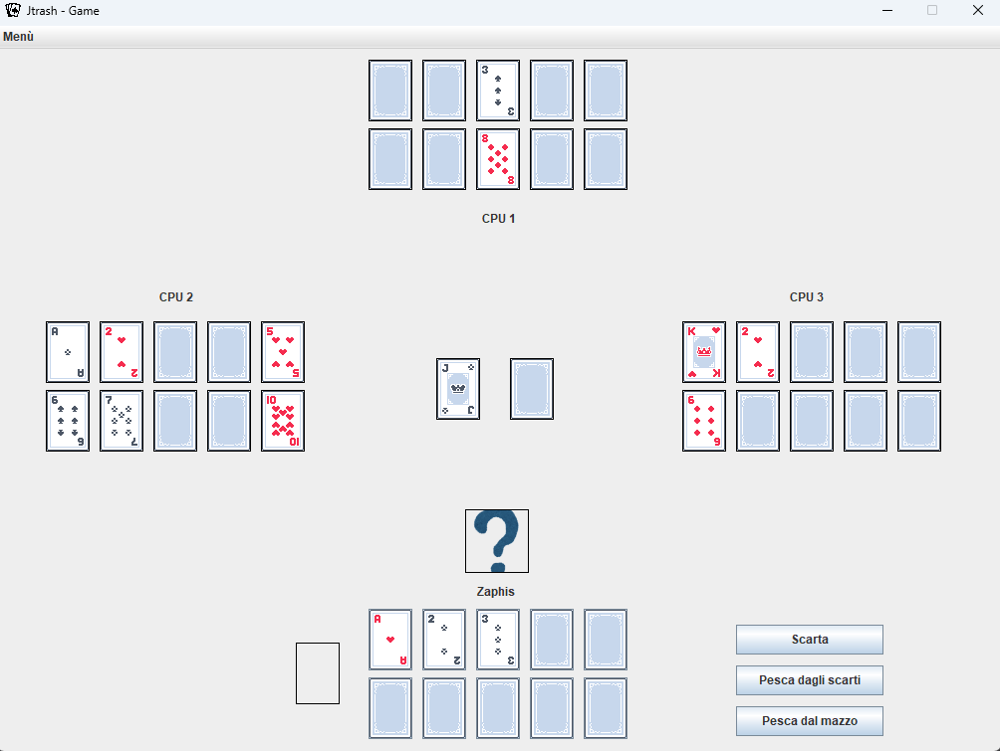

# Jtrash
The card game called Trash, created in java.
# Explanation
This is a university project created for the exam of 'Metodologie di programmazione', course of the first year of Computer Science at La Sapienza university of Rome regarding object oriented programming, java and design patterns.
The project implements the possibility of creating a profile to store your game info and results and it also allows to have multiple users. It's possible to play the card game Trash against 1,2 or 3 cpus.
# Structure 
In JTrashUML we have the UML diagram of the entire project. In Relazione_Jtrash_Java we have a detalied explanation of all the classes of the project, plus the explanation of the design patterns used (mainly Model, View, Controller). 
Inside src/Model we have all the classes plus the assets used. Inside Doc we have documentation for all the relevant methods and classes of the project.

#Main game example

